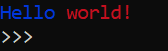
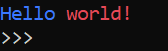
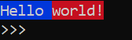
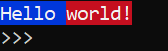
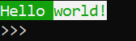
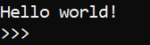

# Tiny-Terminal-Utility-Tools
**"Tiny Terminal Utility Tools"** in short ***ttut*** was created to improve using **terminal** with **python**
## Functions:
### formatText(str)
  
  #### Description
  
  This function colorize text in terminal by using ANSI escape codes.
  
  #### Usage:
  
  Write between **square braces** color that you want to use, for example: ```[blue]Hello [red]world```.

  
  
  There is also possibility for using bright variants of colors by adding "b_" before your color, for example: ```[b_blue]Hello [b_red]world```.

  
  
  You can also choose background color just by adding "bg_" before your color, for example: ```[bg_blue]Hello [bg_red]world```.

  
  
  Note that you can use bright colors for background, for example: ```[bg_b_blue]Hello [bg_b_red]world```.

  

  There is a little diffrence!

  There is also option to bold, underline (**you can choose only one for text, not both**), reverse, reset and set to default.

  

  


  **There is list of all avabile colors**
  - black - black color
  - red - red color
  - green - green color
  - yellow - yellow color
  - blue - blue color
  - magenta - magenta color
  - cyan - cyan color
  - white - white color
  
  **Bright colors**
  - b_black - ~~bright black (???)~~ grey color
  - b_red - bright red color
  - b_green - bright green color
  - b_yellow - bright yellow color
  - b_blue - bright blue color
  - b_magenta - bright magenta color
  - b_cyan - bright cyan color
  - b_white - ~~What the~~ Strong white
  
  **Background colors**
  - bg_black - black background
  - bg_red - red background
  - bg_green - green background
  - bg_yellow - yellow background
  - bg_blue - blue background
  - bg_magenta - magenta background
  - bg_cyan - cyan background
  - bg_white - white background
  
  **Bright background colors**
  - bg_b_black - grey background
  - bg_b_red - bright red background
  - bg_b_green - bright green background
  - bg_b_yellow - bright yellow background
  - bg_b_blue - bright blue background
  - bg_b_magenta - bright magenta background
  - bg_b_cyan - bright cyan background
  - bg_b_white - very white background
  
  **Functional ones**
  - reset - resets to terminal default color
  - bold - ~~Guess~~ bolds the text
  - underline - underlines a text
  - reverse - swaping text color and background color
  - default - default color that you choose
  
### clear()

  #### Description

  Clears the terminal, that's all.

  #### Usage

  ```python
  import ttut
  ttut.clear()
  ```

  or

  ```python
  from ttut import *
  clear()
  ```
  or

  ```python
  from ttut import clear()
  clear()
  ```

### log(text, log_type)

  #### Description

  The text attribute must be a string or int/float (but why ?).

  Default value of attribute is *INFO*. You can also use *WARN* for warnings and *ERROR* for you know what.

  Prints out in terminal the text with type of it and also writes it in the file *log.log*.

  #### Usage

  ```python
  import ttut
  ttut.log("File loaded succesfly")
  ```

  or 

  ```python
  from ttut import *
  log("I'm a warning", "WARN")
  ```

  or

  ```python
  from ttut import log
  log("I'm scarry error", "ERROR")
  ```
